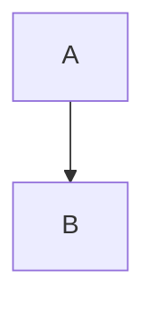

# Markdown to HTML Conversion Guide

Quick reference for converting markdown syntax to HTML when generating visual reports.

## Headers

```markdown
# Title         → <h2>Title</h2>
## Section      → <h3>Section</h3>
### Subsection  → <h4>Subsection</h4>
```

**Note**: Top-level `#` converts to `<h2>` (not `<h1>`) because report title uses `<h1>`.

## Emphasis

```markdown
**bold**   → <strong>bold</strong>
*italic*   → <em>italic</em>
`code`     → <code>code</code>
```

## Lists

```markdown
- Item 1      → <ul><li>Item 1</li>...
1. Item 1     → <ol><li>Item 1</li>...
```

## Code Blocks

````markdown
```javascript
code
```
````

Becomes:

```html
<pre><code class="language-javascript">code</code></pre>
```

**Special case - Mermaid diagrams**:

````markdown

````

Becomes:

```html
<div class="mermaid">
graph TD
A --> B
</div>
```

## Tables

```markdown
| A | B |
|---|---|
| 1 | 2 |
```

Becomes:

```html
<table>
  <thead><tr><th>A</th><th>B</th></tr></thead>
  <tbody><tr><td>1</td><td>2</td></tr></tbody>
</table>
```

## Links

```markdown
[text](url)  → <a href="url">text</a>
```

## Blockquotes

```markdown
> Quote  → <blockquote>Quote</blockquote>
```

## Horizontal Rules

```markdown
---  → <hr>
```

## Special Sections

Wrap important sections in `.card` divs for visual emphasis:

```html
<div class="card">
  <h3>Important Decision</h3>
  <p>Content here...</p>
</div>
```

## Conversion Tips

1. **Preserve line breaks**: Convert `\n\n` to `<p>` tags
2. **Nested lists**: Maintain proper `<ul>`/`<ol>` nesting
3. **Code language**: Add `class="language-{lang}"` to code blocks
4. **Escape HTML**: Escape `<`, `>`, `&` in text content
5. **Mermaid detection**: Check for ` ```mermaid ` code blocks
